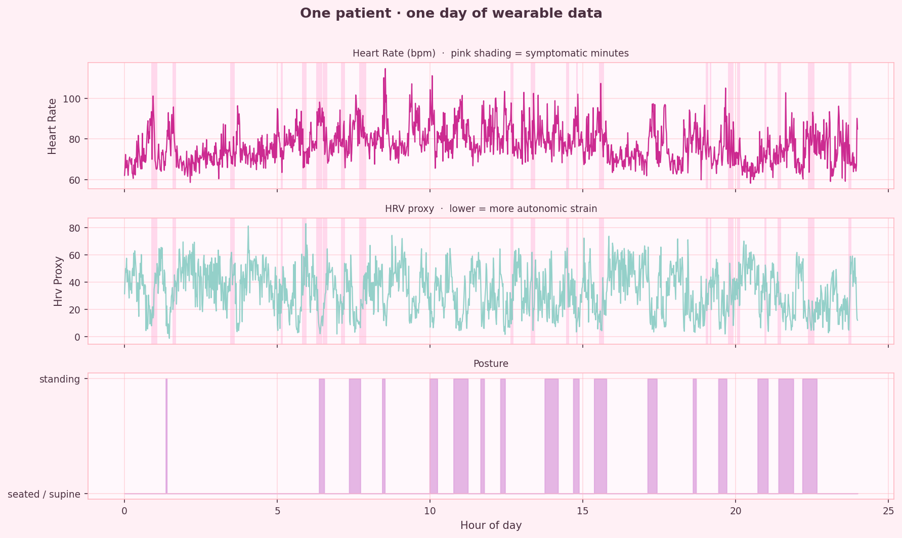
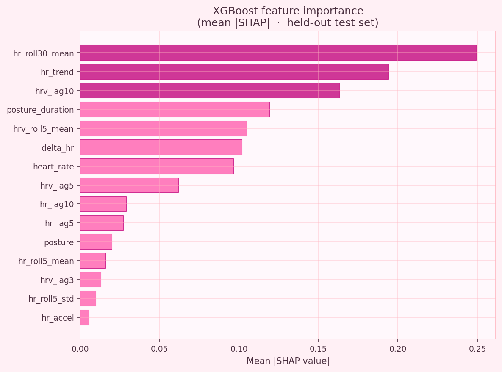

<div align="center">

# 🌸 PoTS episode prediction 🌸


*a machine learning pipeline for forecasting symptomatic PoTS episodes from wearable physiological data*

</div>

---

> **postural orthostatic tachycardia syndrome (PoTS)** is a chronic condition affecting an estimated 1–3 million people in the US, the majority of them women. symptoms (dizziness, tachycardia, fatigue, brain fog) often strike without warning, making daily life unpredictable.
>
> this project explores whether wearable sensor data can give patients a 15-minute heads-up before an episode hits. 💗

---

## 🌷 what this project does

this is a **forecasting pipeline**, not a nowcasting one. the model answers:

> *"based on your heart rate, HRV, and posture over the last 30 minutes — will you likely have a symptomatic episode in the next 15 minutes?"*

knowing you're *currently* symptomatic is useless. knowing you're *about to be* gives you time to sit down, hydrate, take medication, or cancel that standing meeting.

---

## 🩷 results

### what the data looks like



*one synthetic patient, one day. pink shading marks symptomatic minutes. note how HR climbs and HRV drops before symptoms appear — that lag is the signal the model learns.*

---

### what the model learned



the top three features — **30-min HR baseline**, **short-vs-long HR trend**, and **how long the patient has been standing** — are exactly what a clinician would look for. the model isn't cheating; it's learning the right physiology.

---

### model comparison (50 patients × 3 days, 5-fold GroupKFold)

> threshold is chosen per-fold to achieve ≥80% recall with maximum precision — not hardcoded at 0.5.

| model | ROC-AUC | PR-AUC | Brier ↓ | Recall | Precision |
|---|---|---|---|---|---|
| rule baseline | 0.525 ± 0.003 | 0.333 ± 0.009 | 0.285 ± 0.006 | 1.000 | 0.320 |
| logistic regression | 0.624 ± 0.010 | 0.398 ± 0.013 | 0.211 ± 0.004 | 0.800 | 0.379 |
| **XGBoost** | **0.632 ± 0.009** | **0.413 ± 0.011** | **0.210 ± 0.004** | **0.800** | **0.382** |

random PR-AUC baseline (= prevalence) ≈ 0.32. XGBoost is **29% above random** and beats the rule baseline by **+24% PR-AUC**, at the same recall. run `python run.py` to regenerate plots for PR curves, calibration, and full horizon sensitivity.

---

## 🌸 architecture

```
Latent autonomic state (hidden)
        │
        ▼
Physiological signals          →   causal features   →   XGBoost (calibrated)
  HR, HRV proxy, posture                                       ↑
        │                                              Logistic Regression
        ▼                                                       ↑
 Stochastic symptom                                    Rule-based baseline
  emission w/ 5–20 min lag
```

| model | purpose |
|---|---|
| 🩺 rule baseline | would a clinician eyeballing the chart catch this? |
| 📈 logistic regression | is the problem linearly separable? |
| 🌲 XGBoost | can we do better with nonlinear temporal features? |

---

## 💕 key design decisions

### 1. latent-state data generation

a **4-state autonomic Markov model** drives everything. features and labels share a common hidden cause but are never directly coupled.

| state | meaning | standing transition |
|---|---|---|
| 0 — stable | normal compensation | low escalation risk |
| 1 — compensated | mild autonomic stress | moderate escalation |
| 2 — stressed | significant strain | high escalation |
| 3 — decompensating | pre-symptomatic | very high symptom probability |

posture drives transitions. circadian rhythm modulates HR. patient-level severity (`pots_severity ~ Uniform(0.3, 1.0)`) scales reactivity. symptoms are emitted from states 2–3 with a **5–20 min stochastic lag** — making this a genuinely non-trivial forecasting problem.

### 2. strictly causal features

every feature at time *t* uses only data from times ≤ *t*:
- expanding (not rolling) mean for the HR baseline
- backward-only rolling windows
- `min_periods=horizon` on the label so incomplete end-of-series windows drop cleanly

automated leakage tests in `test_leakage.py` enforce this.

### 3. patient-level cross-validation — inner and outer

`GroupKFold` in the outer loop ensures no patient appears in both train and test. the same `GroupKFold` + patient `groups` are passed into `GridSearchCV`/`RandomizedSearchCV` for hyperparameter tuning — so leakage can't re-enter through the inner CV either.

### 4. probability calibration

raw XGBoost scores are not probabilities. `_PlattScaledClassifier` holds out the last 20% of each training fold, fits a logistic regression on top of the raw scores, and produces calibrated probabilities. the serialized model (`models/xgboost_calibrated.pkl`) is the calibrated version.

### 5. clinical threshold selection

`find_clinical_threshold()` finds the highest-precision decision threshold that still achieves ≥80% recall. missing an episode (false negative) is more costly than a false alarm, so we fix minimum sensitivity first and maximize precision within that constraint.

---

## 🌺 feature set (21 features, all causal)

| feature | type | window |
|---|---|---|
| `heart_rate` | raw signal | — |
| `hrv_proxy` | raw signal | — |
| `delta_hr` | deviation from expanding baseline | — |
| `posture` | binary (standing/supine) | — |
| `posture_duration` | minutes in current posture | — |
| `posture_burden_10` | fraction of last 10 min standing | 10 min |
| `hr_roll5_mean` / `_std` | short-term HR trend + volatility | 5 min |
| `hrv_roll5_mean` / `_std` | short-term HRV trend + volatility | 5 min |
| `hr_roll30_mean` | longer-term HR context | 30 min |
| `hr_trend` | short-vs-long HR divergence | 5 vs 30 min |
| `hr_accel` | smoothed rate of HR change | 3 min diff |
| `hr_lag1/3/5/10` | past HR values | 1/3/5/10 min |
| `hrv_lag1/3/5/10` | past HRV values | 1/3/5/10 min |

---

## 🌷 project structure

```
pots-episode-prediction/
├── run.py              # 🎯 single entry point — start here
├── config.py           # all parameters in one place
├── generate_data.py    # latent-state synthetic data generator
├── features.py         # strictly causal feature engineering
├── train.py            # GroupKFold training (LogReg + XGBoost)
├── evaluate.py         # metrics + clinical threshold selection
├── plots.py            # pink-themed visualizations
├── test_leakage.py     # automated leakage detection
├── requirements.txt
├── data/               # generated datasets (gitignored)
├── models/             # trained models (gitignored)
└── plots/              # generated figures
```

---

## 🩷 how to run

```bash
git clone https://github.com/acaligac/PoTSml.git
cd PoTSml
pip install -r requirements.txt
python run.py
```

this will generate data, train all models, print results, run horizon sensitivity, and save all plots to `plots/`.

---

## 🌸 honest limitations

this is a **proof-of-concept on synthetic data**. not validated on real patients.

| limitation | notes |
|---|---|
| synthetic data only | real PoTS dynamics may differ significantly |
| no real-world validation | future work pending IRB-approved dataset access |
| HR signal is i.i.d. per timestep | real wearable data has AR(1) autocorrelation |
| 50 patients | effective sample size is much lower due to temporal dependence |

---

## 💗 future roadmap

- [ ] validation against real wearable data (Apple Watch / Garmin exports)
- [ ] multi-day temporal train/test split (train days 1–5, test days 6–7)
- [ ] AR(1) noise in HR signal for more realistic autocorrelation
- [x] label correctness test in `test_leakage.py`

---

<div align="center">

*built with care for everyone navigating life with PoTS* 🌸

</div>
